# Quantarhei Class Architecture

## End-to-End Data Flow

How the subsystems connect — the typical pipeline from system construction to observable:

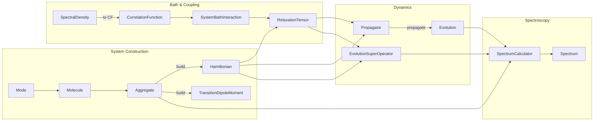

## Typical Usage Pipeline

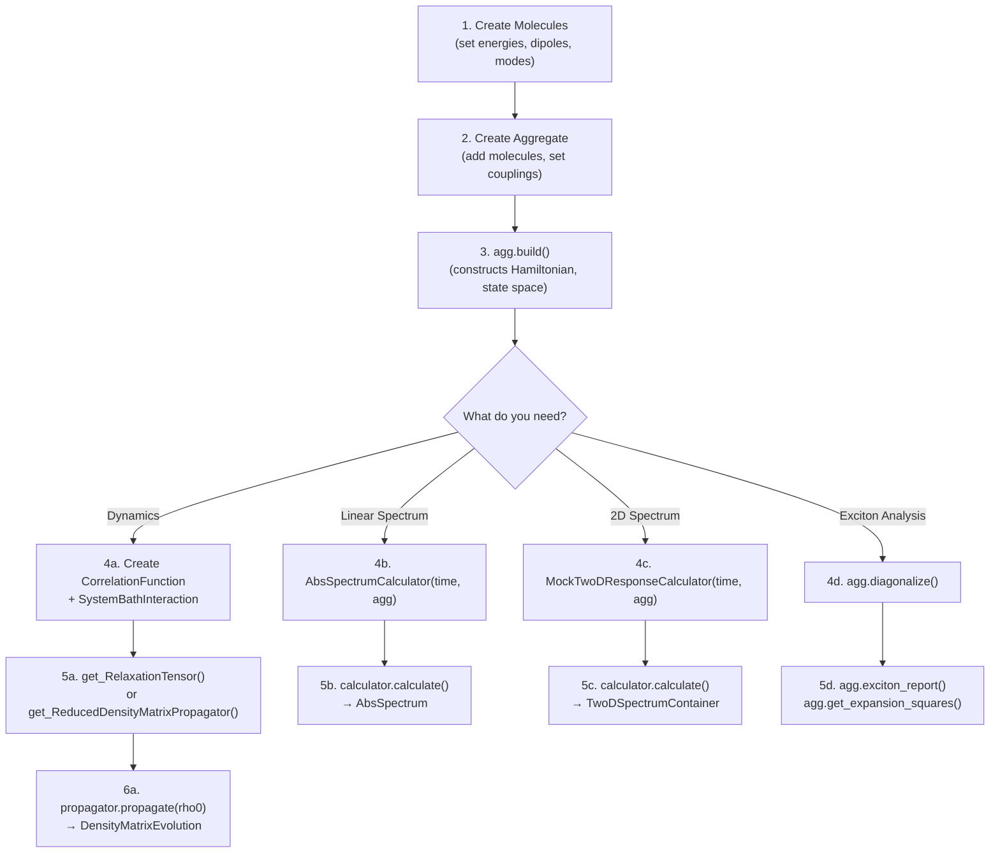

## Public API (`from quantarhei import ...`)

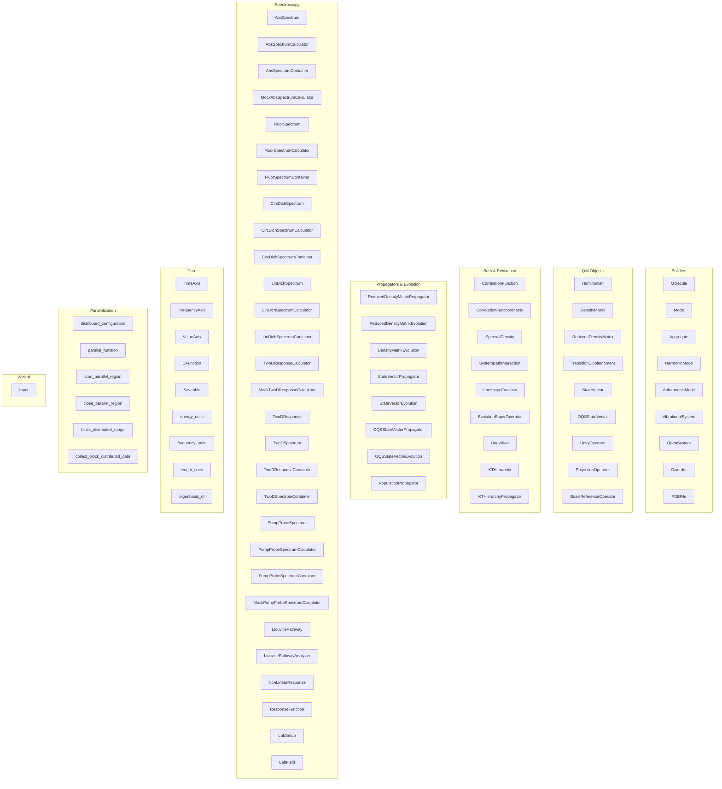

## Manager & Context Managers (Global State)

The `Manager` singleton coordinates units and basis across all objects:

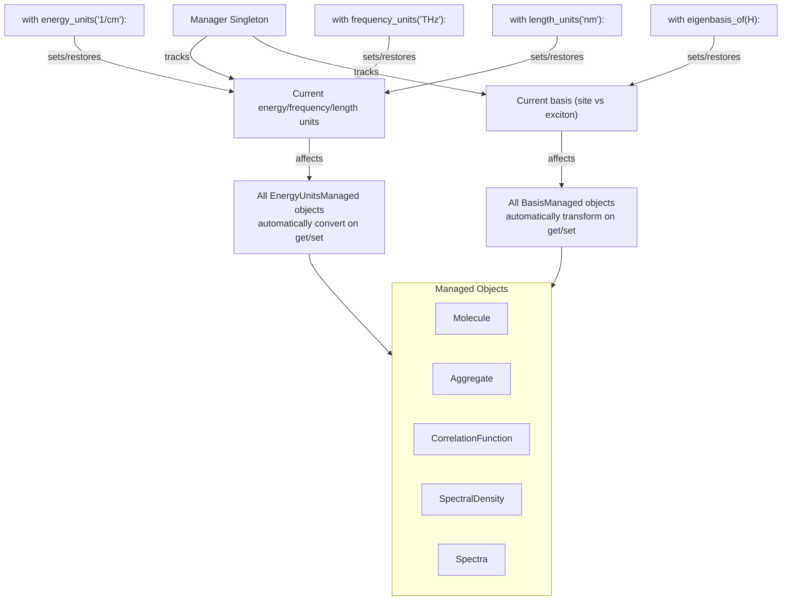

## build() Lifecycle

What happens when you call `agg.build()`:

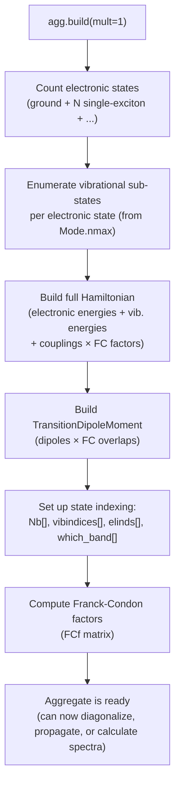

## Aggregate Inheritance Chain

The core of quantarhei is the `Aggregate` class, built via a deep inheritance chain where each layer adds specific capabilities:

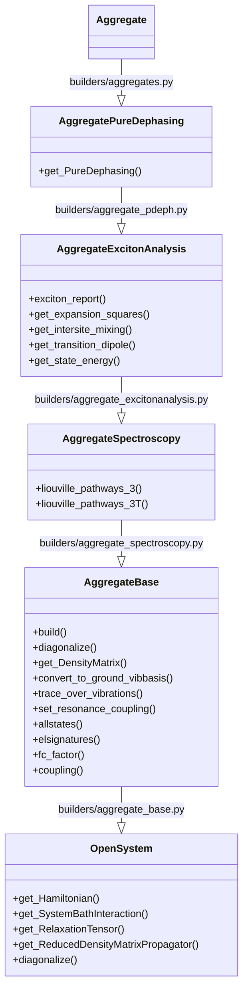

## Molecular Building Blocks

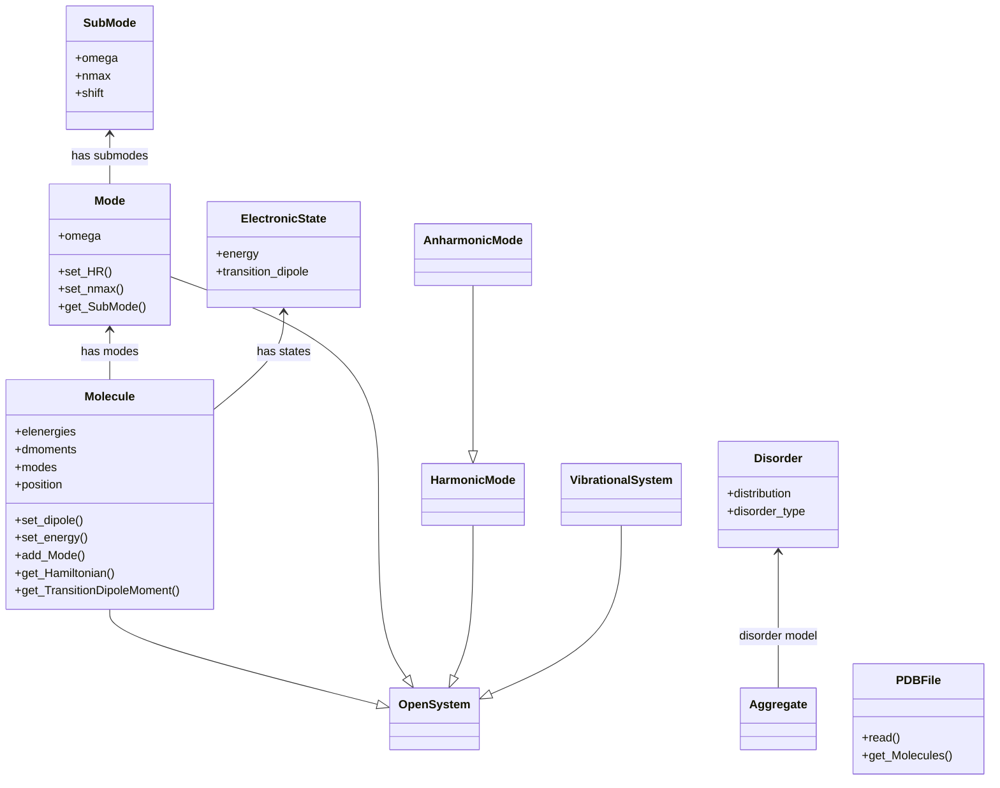

## Quantum Mechanics: Operators & States

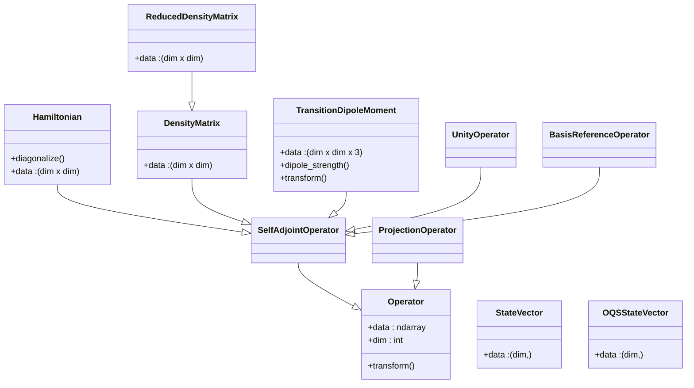

## Quantum Mechanics: Propagators & Evolution

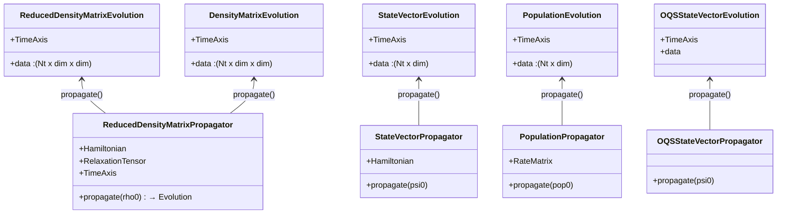

## Quantum Mechanics: Relaxation Tensors

```mermaid
classDiagram
    direction BT

    SuperOperator <|-- RelaxationTensor
    RelaxationTensor <|-- RedfieldRelaxationTensor
    RelaxationTensor <|-- FoersterRelaxationTensor
    RelaxationTensor <|-- ModRedfieldRelaxationTensor
    RelaxationTensor <|-- TDModRedfieldRelaxationTensor
    RedfieldRelaxationTensor <|-- TDRedfieldRelaxationTensor
    RedfieldRelaxationTensor <|-- LindbladForm
    FoersterRelaxationTensor <|-- TDFoersterRelaxationTensor
    FoersterRelaxationTensor <|-- RedfieldFoersterRelaxationTensor
    RedfieldFoersterRelaxationTensor <|-- TDRedfieldFoersterRelaxationTensor
    TDFoersterRelaxationTensor <|-- NEFoersterRelaxationTensor
    LindbladForm <|-- ElectronicLindbladForm
    LindbladForm <|-- VibrationalDecayLindbladForm
    SuperOperator <|-- EvolutionSuperOperator
    SuperOperator <|-- SOpUnity
    SuperOperator <|-- Liouvillian

    class RelaxationTensor {
        +Hamiltonian
        +SystemBathInteraction
        +data : (dim x dim x dim x dim)
    }

    class RedfieldRelaxationTensor {
        Secular approximation
        Weak system-bath coupling
    }

    class FoersterRelaxationTensor {
        Strong coupling limit
        Localized basis
    }

    class ModRedfieldRelaxationTensor {
        Modified Redfield
        Includes reorganization
    }

    class LindbladForm {
        Lindblad master equation
        Completely positive
    }

    class RedfieldFoersterRelaxationTensor {
        Combined theory
        Redfield within clusters
        Foerster between clusters
    }

    class NEFoersterRelaxationTensor {
        Non-equilibrium Foerster
        Time-dependent donor state
    }

    class EvolutionSuperOperator {
        +at(t) → SuperOperator
        +data : (Nt x dim² x dim²)
    }

    class Liouvillian {
        +data
    }
```

## Quantum Mechanics: Rate Matrices

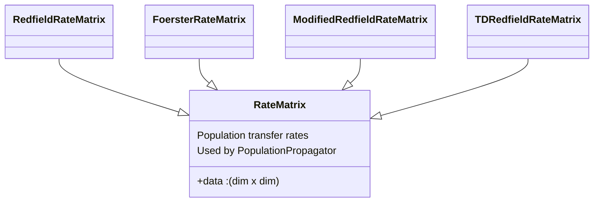

## Quantum Mechanics: HEOM & Advanced Propagators

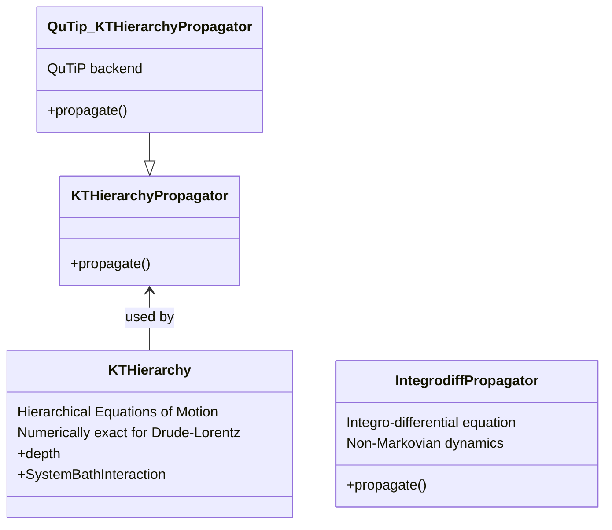

## Correlation Functions & Spectral Densities

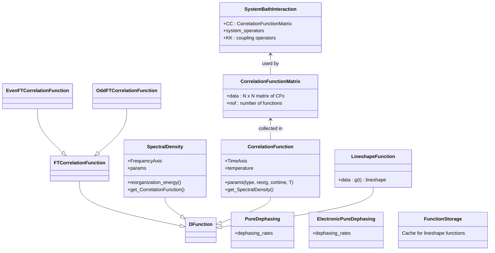

## Spectroscopy: Linear Spectra

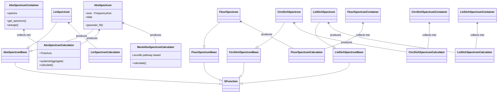

## Spectroscopy: Nonlinear (2D & Pump-Probe)

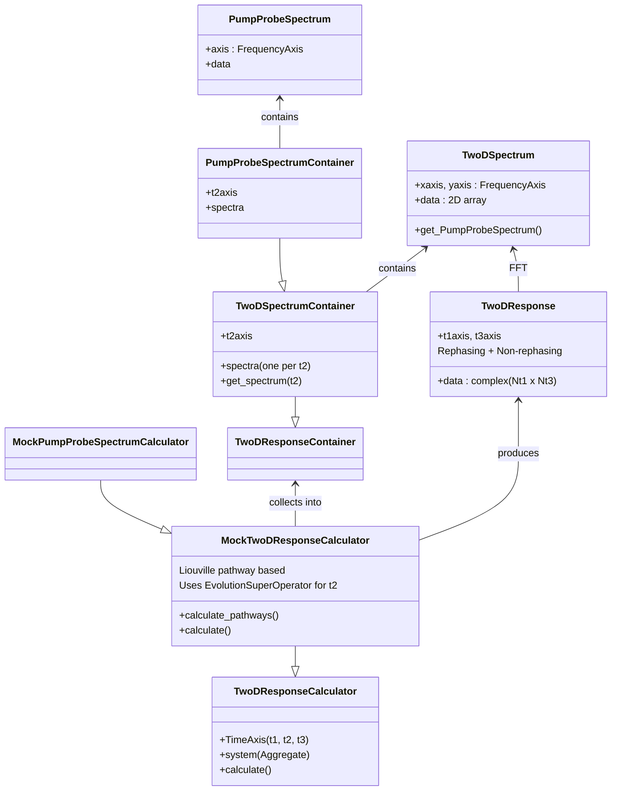

## Spectroscopy: Liouville Pathways & Diagrams

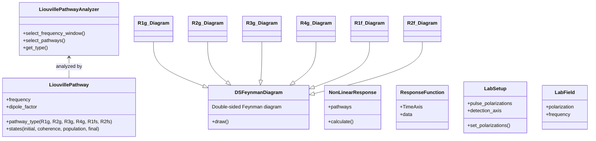

## Core Infrastructure

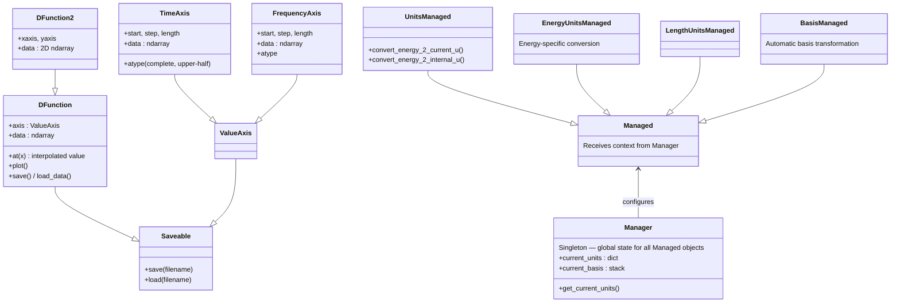

## Core: Context Managers

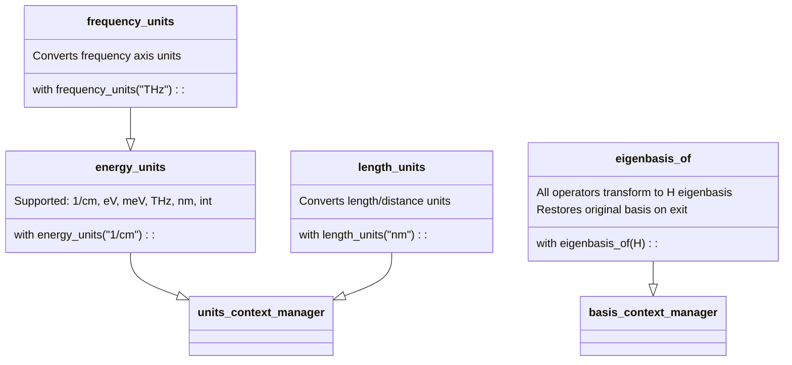

## Core: Parallelization

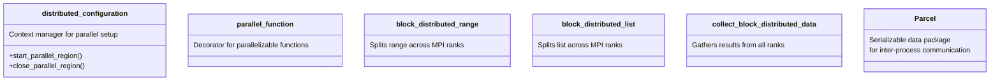

## Models & Databases

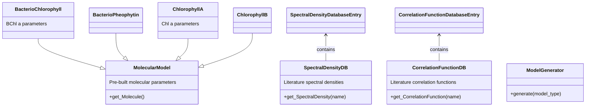

## Wizard (High-Level Interface)

```mermaid
classDiagram
    direction BT

    Simulation <|-- ExcitonDynamics
    Simulation <|-- TwoDPathways

    class Simulation {
        High-level simulation runner
        +input : Input
        +run()
    }

    class Input {
        +parameters : dict
        Configuration for Wizard simulations
    }

    class ExcitonDynamics {
        Population/coherence dynamics
    }

    class TwoDPathways {
        2D spectroscopy via pathways
    }
```

## Module Dependency Map

```
quantarhei/
├── core/              ← Axes, units, managers, DFunction, saving, parallelization
│   ├── managers.py         (Manager singleton, energy_units, eigenbasis_of, ...)
│   ├── time.py             (TimeAxis)
│   ├── frequency.py        (FrequencyAxis)
│   ├── valueaxis.py        (ValueAxis base)
│   ├── dfunction.py        (DFunction - data on axis)
│   ├── saveable.py         (Serialization: save/load)
│   ├── parallel.py         (distributed_configuration, parallel_function)
│   ├── parcel.py           (Parcel - inter-process data)
│   └── units.py            (convert, in_current_units)
│
├── builders/          ← Physical system construction
│   ├── molecules.py          (Molecule)
│   ├── modes.py              (Mode, SubMode)
│   ├── aggregate_base.py     (AggregateBase: build, diagonalize, basis conversion)
│   ├── aggregate_spectroscopy.py  (liouville_pathways_3, _3T)
│   ├── aggregate_excitonanalysis.py (exciton_report, expansion squares)
│   ├── aggregate_pdeph.py    (get_PureDephasing)
│   ├── aggregates.py         (Aggregate - top-level user class)
│   ├── opensystem.py         (OpenSystem - relaxation theory interface)
│   ├── disorder.py           (Disorder models)
│   ├── pdb.py                (PDB file parsing)
│   └── sysmodes.py           (HarmonicMode, AnharmonicMode)
│
├── qm/                ← Quantum mechanical objects
│   ├── hilbertspace/
│   │   ├── operators.py       (Operator, SelfAdjointOperator)
│   │   ├── hamiltonian.py     (Hamiltonian)
│   │   ├── dmoment.py         (TransitionDipoleMoment)
│   │   └── statevector.py     (StateVector, OQSStateVector)
│   ├── liouvillespace/
│   │   ├── superoperator.py   (SuperOperator)
│   │   ├── redfieldtensor.py  (RedfieldRelaxationTensor, TDRedfield)
│   │   ├── foerstertensor.py  (FoersterRelaxationTensor, TDFoerster)
│   │   ├── modrftensr.py      (ModRedfieldRelaxationTensor)
│   │   ├── lindbladform.py    (LindbladForm, Electronic, VibrationalDecay)
│   │   ├── redfieldfoerster.py (RedfieldFoersterRelaxationTensor)
│   │   ├── nefoerstertensor.py (NEFoersterRelaxationTensor)
│   │   ├── evolutionsuperoperator.py (EvolutionSuperOperator)
│   │   ├── puredephasing.py   (PureDephasing, ElectronicPureDephasing)
│   │   ├── rates.py           (RateMatrix variants)
│   │   ├── heom.py            (KTHierarchy, KTHierarchyPropagator)
│   │   ├── systembathinteraction.py (SystemBathInteraction)
│   │   └── supopunity.py      (SOpUnity - identity superoperator)
│   ├── corfunctions/
│   │   ├── correlationfunctions.py  (CorrelationFunction, CF matrix)
│   │   ├── spectraldensities.py     (SpectralDensity)
│   │   ├── lineshapes.py            (LineshapeFunction)
│   │   └── functionstorages.py      (FunctionStorage, FastFunctionStorage)
│   ├── propagators/
│   │   ├── rdmpropagator.py         (ReducedDensityMatrixPropagator)
│   │   ├── svpropagator.py          (StateVectorPropagator)
│   │   ├── poppropagator.py         (PopulationPropagator)
│   │   ├── dmevolution.py           (DensityMatrixEvolution)
│   │   └── statevectorevolution.py  (StateVectorEvolution)
│   └── oscillators/
│       └── ho.py                    (Harmonic oscillator algebra)
│
├── spectroscopy/      ← Spectrum calculation
│   ├── abs2.py                  (AbsSpectrum)
│   ├── abscalculator.py         (AbsSpectrumCalculator)
│   ├── abscontainer.py          (AbsSpectrumContainer)
│   ├── mockabscalculator.py     (MockAbsSpectrumCalculator)
│   ├── fluorescence.py          (FluorSpectrum, Calculator, Container)
│   ├── circular_dichroism.py    (CircDichSpectrum, Calculator, Container)
│   ├── linear_dichroism.py      (LinDichSpectrum, Calculator, Container)
│   ├── twodresponse.py          (TwoDResponse)
│   ├── twodcalculator.py        (TwoDResponseCalculator)
│   ├── mocktwodcalculator.py    (MockTwoDResponseCalculator)
│   ├── twodcontainer.py         (TwoDResponseContainer, TwoDSpectrumContainer)
│   ├── twodspect.py             (TwoDSpectrum)
│   ├── pumpprobe.py             (PumpProbeSpectrum, Calculator, Container)
│   ├── pathwayanalyzer.py       (LiouvillePathwayAnalyzer)
│   ├── responses.py             (LiouvillePathway, NonLinearResponse)
│   ├── diagramatics.py          (DSFeynmanDiagram, R1g/R2g/.../R2f)
│   └── labsetup.py              (LabSetup, LabField)
│
├── models/            ← Pre-built molecular models & spectral density database
│   ├── molecularmodels.py       (BacterioChlorophyll, Chlorophyll, etc.)
│   └── spectral_densities.py   (SpectralDensityDB, CorrelationFunctionDB)
│
├── wizard/            ← High-level simulation interface
│   ├── simulation.py            (Simulation, ExcitonDynamics, TwoDPathways)
│   └── input/input.py           (Input)
│
└── symbolic/          ← Cumulant expansion theory (SymPy-based, advanced)
    └── cumulant.py              (CumulantExpr, symbolic operators dV, Uop, etc.)
```
